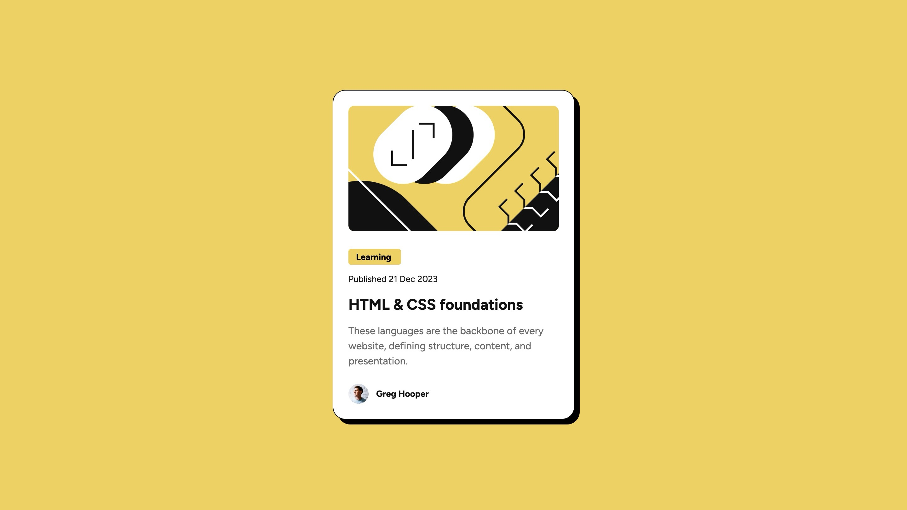
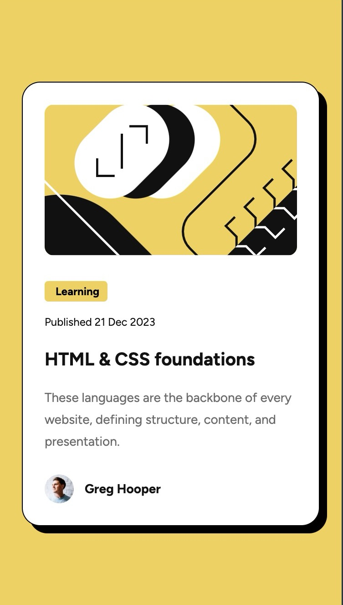

# Frontend Mentor - Blog preview card solution

This is a solution to the [Blog preview card challenge on Frontend Mentor](https://www.frontendmentor.io/challenges/blog-preview-card-ckPaj01IcS). Frontend Mentor challenges help you improve your coding skills by building realistic projects.

## Overview

### Screenshot




### Links

- [Solution](https://github.com/Lokesh8055/frontendmentor.io/tree/main/qr-code-component)
- [LiveSite](https://lokesh-qr-code-challenge.netlify.app/)

## My process

### Built with

- Semantic HTML5 markup
- CSS custom properties, BEM convention
- FlexBox
- Mobile-first workflow

### What I learned

Learned about boxShadow property and how i can reuse styles

```css
box-shadow: 8px 8px 0px 0px var(--black);
```

### Continued development

Will continue my focus on responsive web design principles

## Author

- Frontend Mentor - [@Lokesh8055](https://www.frontendmentor.io/profile/Lokesh8055)
