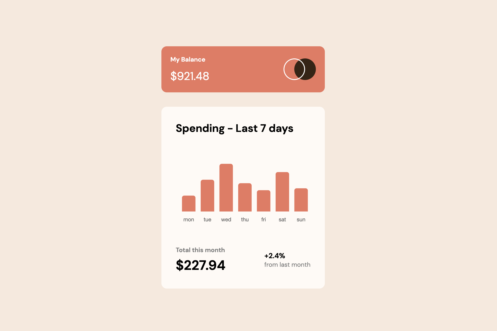

# Frontend Mentor - Expenses chart component component solution

This is a solution to the [Expenses chart componentchallenge on Frontend Mentor](https://www.frontendmentor.io/challenges/expenses-chart-component-e7yJBUdjwt). Frontend Mentor challenges help you improve your coding skills by building realistic projects. 

## Table of contents
  - [Overview](#overview)
    - [The challenge](#the-challenge)
    - [Screenshot](#screenshot)
    - [Links](#links)
  - [My process](#my-process)
    - [Built with](#built-with)
  - [Author](#author)

## Overview

### The challenge

Users should be able to:

- View the bar chart and hover over the individual bars to see the correct amounts for each day
- See the current day's bar highlighted in a different colour to the other bars
- View the optimal layout for the content depending on their device's screen size
- See hover states for all interactive elements on the page
- Bonus: See dynamically generated bars based on the data provided in the local JSON file
### Screenshot

### Links

- [Solution](https://github.com/Lokesh8055/frontendmentor.io/tree/main/expense-chart-challenge)
- [Live](https://expense-chart-lp.netlify.app/)

## My process

### Built with

- HTML5
- CSS 3
- React JS
- Chart JS

## Author

- Frontend Mentor - [@Lokesh](https://www.frontendmentor.io/profile/Lokesh8055)
