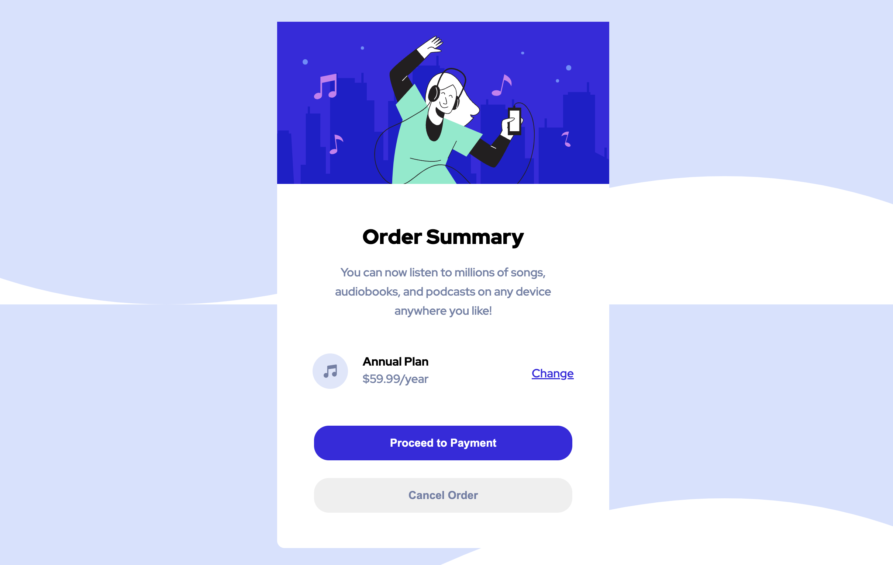
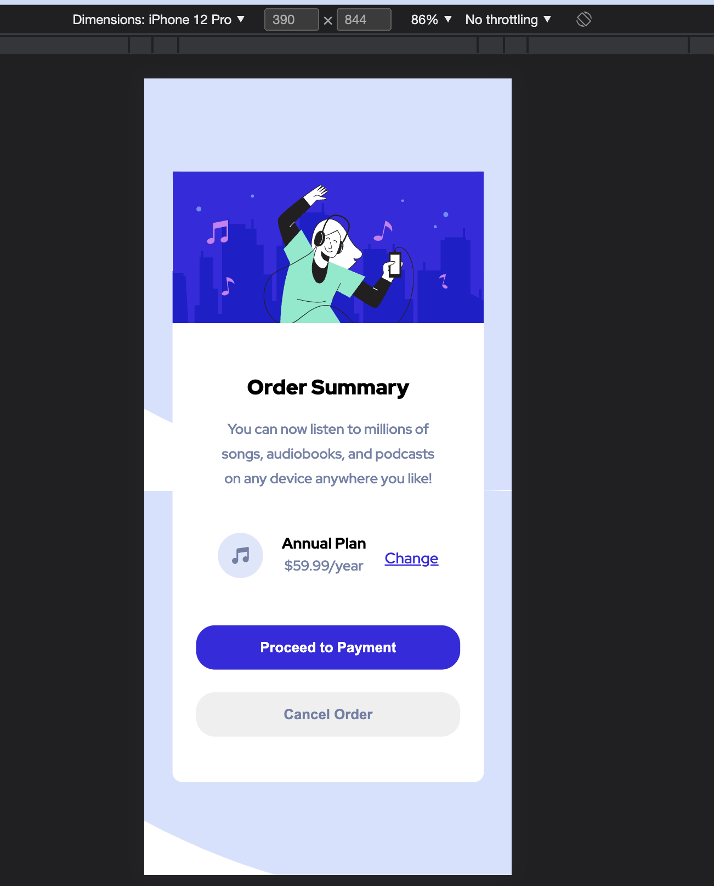

# Frontend Mentor - Expenses chart component component solution

This is a solution to the [Order summary component challenge on Frontend Mentor](https://www.frontendmentor.io/challenges/order-summary-component-QlPmajDUj). Frontend Mentor challenges help you improve your coding skills by building realistic projects. 

## Table of contents
  - [Overview](#overview)
    - [The challenge](#the-challenge)
    - [Screenshot](#screenshot)
    - [Links](#links)
  - [My process](#my-process)
    - [Built with](#built-with)
  - [Author](#author)

## Overview

### The challenge

Users should be able to:

- See hover states for interactive elements

### Screenshot

### Links

- [Solution](https://github.com/Lokesh8055/frontendmentor.io/tree/main/expense-chart-challenge)
- [Live](https://expense-chart-lp.netlify.app/)

## My process

### Built with
- HTML5
- CSS 3

## Author
- Frontend Mentor - [@Lokesh](https://www.frontendmentor.io/profile/Lokesh8055)
