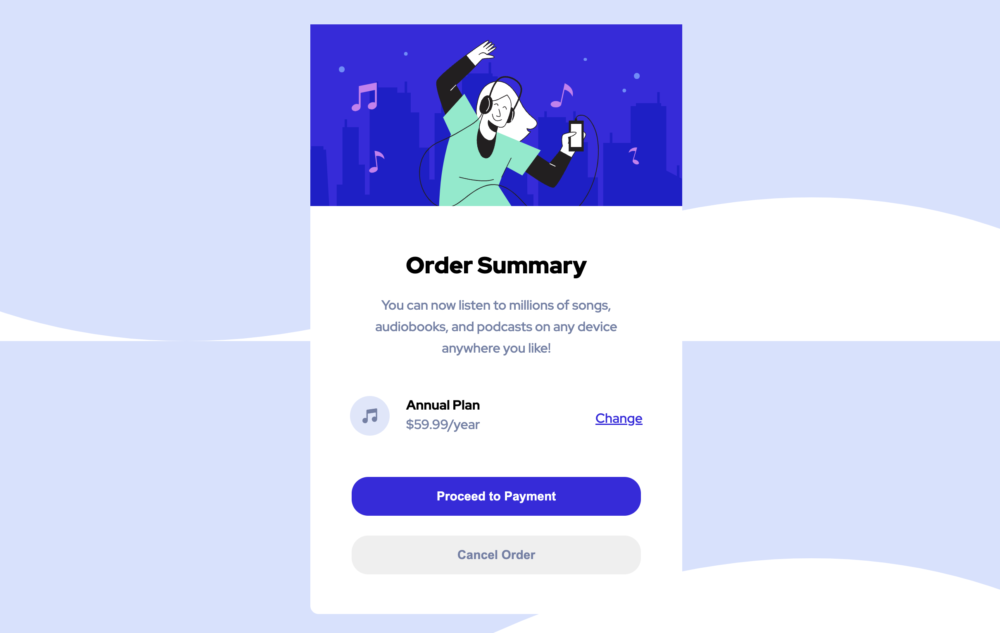
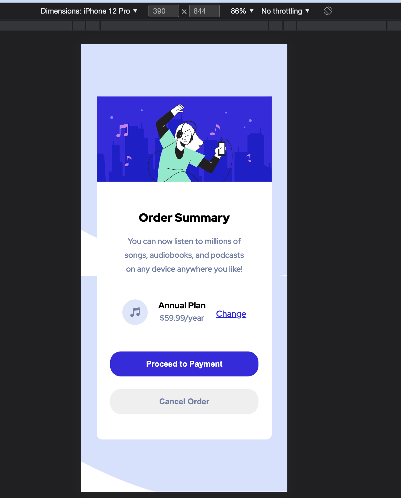

# Order Summary
  Order summary application creating using HTML5 and CSS3

## Functionalities
1. Users will be able to see hover states for interactive elements
2. Application is Responsive and will work on different screen sizes.

## Live Application URL

The Application is deployed in https://order-summary-lp.netlify.app/

### Screenshot

#### Desktop

#### Mobile

